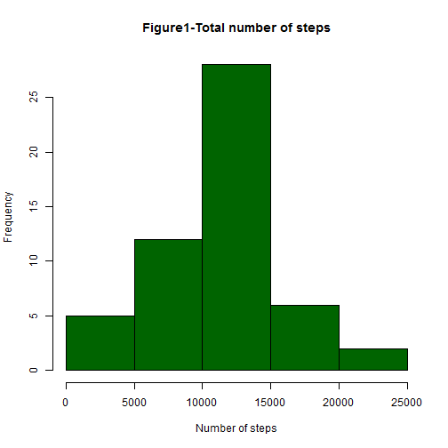
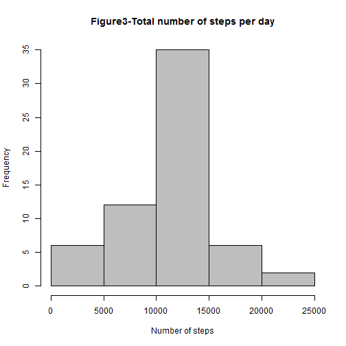

##This document has been prepared as part of the first assignment of Reproducible Research course.  The document contains the code and the answers to the different questions in the assignment.

##Loading and preprocessing the data

```r
activity<-read.csv("activity.csv")
```
##Q1. Total number of steps per day
###To calculate the total number of steps per day the aggregate function has been used

```r
daysteps<-aggregate(steps~date, activity, sum)
```
###Creating a histogram with the total number of steps taken each day

```r
hist(daysteps$steps, main = paste("Figure1-Total number of steps"), xlab = "Number of steps", col = "dark green")
```

 


###Finding the mean and median of the number of steps every day

```r
activitymean<-mean(daysteps$steps)
activitymedian<-median(daysteps$steps)
```
##Q2.Average daily activity pattern
###Use the aggregate function to calculate the average number of steps across all days

```r
averagesteps<-aggregate(steps~interval, activity, mean)
plot(averagesteps$interval, averagesteps$steps, type = "l", xlab = "Interval", ylab = "Average number of Steps", main = "Figure2-Average daily activity pattern", col = "blue")
```

 

```r
maxinterval<-averagesteps[which.max(averagesteps$steps),1]
```

####The 835 interval has the average maximum number of steps which is 206.
##Q3.Imputing the missing values
###Total number of rows with missing values 

```r
missingdata<-sum(is.na(activity))
```
###Assigning another variable to the same dataframe "activity". Imputing values on this new dataframe so that it can be compared to original dataframe

```r
imputedactivity<-activity
imputedactivity$steps[which(is.na(imputedactivity$steps))]<-averagesteps$steps
```
###As 10-01-2012 is the first day of data collection, the NA's have been imputed with 0 so that the data does not get blown up. 

```r
imputedactivity[as.character(imputedactivity$date) == "2012-10-01", 1] <- 0
```


###Calculation of the total number of steps per day for the imputed data and a histogram for the same

```r
imputedtotalsteps<-aggregate(steps~date, imputedactivity, sum)
hist(imputedtotalsteps$steps, main = paste("Figure3-Total number of steps per day"), xlab = "Number of steps", col = "grey")
```

 


###Calculation of mean and median for the imputed data

```r
imputedactivitymean<-mean(imputedtotalsteps$steps)
imputedactivitymedian<-median(imputedtotalsteps$steps)
```
####Once the imputation is done, the difference between the imputed data and the original data will give an idea of the change.

```r
meandifference<-imputedactivitymean - activitymean
mediandifference<-imputedactivitymedian - activitymedian
```
####Imputation has reduced the mean to a large extent whereas the median has not been affected
##Q4.Differences in activity patterns between weekdays and weekends?


```r
weekdays <- c("Monday", "Tuesday", "Wednesday", "Thursday", 
              "Friday")
imputedactivity$dow = as.factor(ifelse(is.element(weekdays(as.Date(imputedactivity$date)),weekdays), "Weekday", "Weekend"))
imputedinterval <- aggregate(steps ~ interval + dow, imputedactivity, mean)
library(lattice)
xyplot(imputedinterval$steps ~ imputedinterval$interval|imputedinterval$dow, main="Figure4-Average steps per day based on Interval",xlab="Interval", ylab="Number of steps",layout=c(1,2), type="l")
```

 

